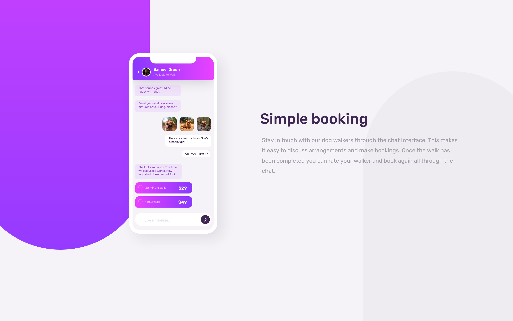
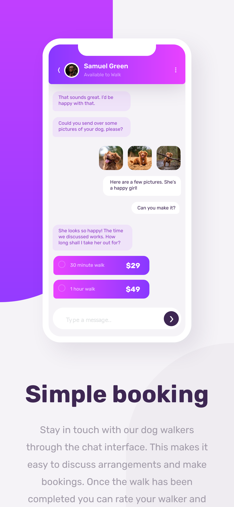

# Frontend Mentor - Chat app CSS illustration solution

This is a solution to the [Chat app CSS illustration challenge on Frontend Mentor](https://www.frontendmentor.io/challenges/chat-app-css-illustration-O5auMkFqY). Frontend Mentor challenges help you improve your coding skills by building realistic projects.

## Table of contents

- [Overview](#overview)
  - [The challenge](#the-challenge)
  - [Screenshot](#screenshot)
  - [Links](#links)
- [My process](#my-process)
  - [Built with](#built-with)
  - [What I learned](#what-i-learned)
  - [Continued development](#continued-development)
  - [Useful resources](#useful-resources)
- [Author](#author)
- [Acknowledgments](#acknowledgments)

**Note: Delete this note and update the table of contents based on what sections you keep.**

## Overview

### The challenge

Users should be able to:

- View the optimal layout for the component depending on their device's screen size
- **Bonus**: See the chat interface animate on the initial load

### Screenshots

### Links

- Solution URL: [github](https://github.com/serfoll/chat-app-css-illustration)
- Live Site URL: [Netlify](https://your-live-site-url.com)

## My process

### Built with

- Semantic HTML5 markup
- CSS custom properties
- SCSS
- Flexbox
- Mobile-first workflow
- [Parcel](https://parceljs.org/) - For bundling -[PUG](https://pugjs.org/api/getting-started.html) - View Engine
- [SCSS](https://sass-lang.com/) - For styling

### What I learned

Using unicode instead of SVG or font-awesome icons. Building a simple project with parceljs and usign pug as the view engine along with sass for styling. Some hickups (sass HMR worked but styles wasn't compiling or being loaded on hard reload) along the way when building, but the documentation from parceljs was helpful.

### Useful resources

- [UTF-8 Ref](https://www.w3schools.com/charsets/ref_utf_dingbats.asp) - Unicodes available for use in both CSS and HTML

## Author

- Frontend Mentor - [@serfoll](https://www.frontendmentor.io/profile/serfoll)
- Twitter - [@sergio_fol](https://www.twitter.com/sergio_fol)
